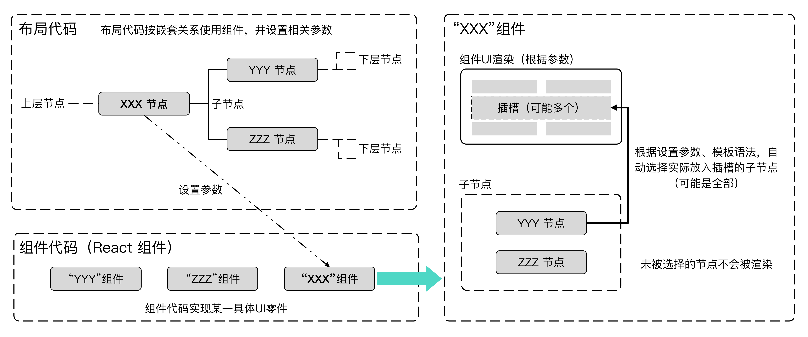

- 最新稳定版本: 2.2=2025.06.10
- 使用文档详见官网，[点击跳转使用手册](https://stoprefactoring.com/#content@content#framework/trick/)

- Latest stable version: 2.2=2025.06.10
- For the user manual, please refer to the official website, [click to jump to the user manual](https://stoprefactoring.com/#content@content#framework/trick/)

# 编写网页-就像搭积木一样

**Trick框架将一个网页分离为了两个部分，UI部分、逻辑部分**。UI部分，用于HTML页面描画；逻辑部分，用于逻辑功能执行。

**Trick框架将这两部分的代码都分离了业务代码、模块代码**。业务代码由JSON配置，是对可复用模块进行编排；模块代码是实际实现UI描画、逻辑功能的代码，可无条件复用多个项目。

**Trick框架关注的是开发效率和维护成本**，业务开发由于不需要关心实际的运行原理，可交由经验较浅的程序员（或其他领域程序员）完成；模块代码虽然需要有一定React、Js、Webpack等开发经验的程序员才能胜任，但是一经开发完成，即可无条件复用在多个项目。

Trick框架是一套前端应用的**顶层架构**，架构本身只约束了工程结构和开发过程，对前端应用的基础技术**无任何改造和深度封装，没有黑盒代码**。

**Trick框架只是一套规则**，实际上是一个Webpack（React、tailwindcss、headlessUI）工程，任何问题都可以通过翻看实际代码排查。

# Write a web page - Just like building blocks

**The Trick framework separates a web page into two parts, UI part and logical part.** The UI part is used for HTML page drawing; the logical part is used for the execution of logical functions.

**The Trick framework separates these two parts of the code from the business code and the module code**. The business code is configured by JSON and arranges reusable modules; the module code is the code that actually realizes UI drawing and logical functions, which can unconditionally reuse multiple projects.

**The Trick framework focuses on development efficiency and maintenance costs**. Because business development does not need to care about the actual operating principle, it can be completed by inexperienced programmers (or other field programmers); although the module code requires programmers with certain development experience such as React, Js, Webpack, etc. Only then can it be competent, but once the development is completed, it can be unconditionally reused in multiple projects.

The Trick framework is a set of **top-level framework** of front-end applications. The framework itself only restricts the engineering structure and development process. **There is no transformation and in-depth encapsulation** of the basic technology of front-end applications, and **there is no black box code**.

**The Trick framework is just a set of rules**. In fact, it is a Webpack (React, tailwindcss, headlessUI) project. Any problem can be sorted out by looking through the actual code.

# 基础技术

Trick框架是一种顶层架构，架构本身只约束了工程结构和开发过程，对基础技术无任何改造和深度封装。

框架中采用的基础技术如下：

- **开发语言**：Javascript（ES6）、CSS3、JSX
- **基础框架**：React 18.3.1、Tailwind CSS 3.4.10、headlessUI 2.2.0
- **项目自动构建工具**：Webpack 5.93.0（需要Node 18.x运行环境）

其中，由于Trick框架只是一种规则，基础技术甚至是开发语言都是可以替换的，可联系官方打造个性化架构。

# Basic technology

Once architecture is a top-level architecture. The architecture itself only constrains the engineering structure and development process, and does not have any transformation or deep encapsulation of basic technology.

The basic technologies used in the framework are as follows:

- **Development language**: Javascript（ES6）、CSS3、JSX

- **Basic framework**: React 18.3.1、Tailwind CSS 3.4.10、headlessUI 2.2.0

- **Project automatic construction tool**: Webpack 5.93.0 (Node 18.x running environment is required)

Among them, because the Trick framework is only a rule, the basic technology and even the development language can be replaced, and you can contact the official to create a personalized architecture.

# 前提知识

在使用Trick架构前，**最好先学习React、Tailwind CSS、headlessUI、网页开发等**相关知识。

Trick框架只是一种规则，实际上是一个`React`工程（webpack编译），要想深度使用、或者排查一些错误，最好先学习这些知识。

# Prerequisite knowledge

**Before using** the Trick framework, it is **best to learn React, Tailwind CSS, headlessUI, Web page development** and other relevant knowledge.

Trick framework is just a rule. It is actually a `React` project (Compiled by webpack). If you want to use it in depth or check some errors, it is best to learn this knowledge first.

# 设计思想

Trick架构的设计思想可以直白地理解为：**希望所有代码都只写一次**。

代码可以只写一次的部分，希望能无条件复用在多个项目。代码不能只写一次的部分（业务强关联），那就简化其表达，用代码生成器生成它。

从宏观上讲，**一个页面应该分离为两部分，UI部分、逻辑部分**。

- UI部分，用于HTML页面描画
- 逻辑部分，用于逻辑功能执行

## UI部分设计思想

**对于UI部分而言，就好比是一个沙盘，按指定位置摆放UI组件，单个UI组件也可以是一个小沙盘，在此摆放其他UI组件。**

以一个表单页面为例，可以对其理解为：页面中摆放了“标题”“表单”，“表单”中摆放了“多个表单项”“按钮”，单个“表单项”中摆放了“标题”“输入框”

 

针对UI部分，**Trick将代码分离成了两层：组件代码、布局代码**。

> 组件代码、布局代码实际上就是“停止重构的代码分层理论”中的模块代码，业务代码，这里为了防止与逻辑部分混淆，取了别名。

**组件代码**是实际UI零件的代码，**只关心通用UI零件的实现**，拥有统一的使用方式，所以这部分的代码可以只写一次，且可以无条件复用在多个项目。

**布局代码**是跟具体页面的业务强关联的，**只关心页面的布局**，也就是对组件摆放顺序进行编排，例如：页面中摆放“标题”“表单”，“表单”中摆放“多个表单项”“按钮”。所以布局代码可以使用JSON进行简化，并使用Christmas（代码生成器）生成代码。

## 逻辑部分设计思想

**对于逻辑部分而言，就是多个逻辑功能的合集，对于单个逻辑功能而言，是多个步骤的集合**。

以一个表单页面的提交功能为例，可以对其理解为：第1步“获取UI数据”，第2步“检查数据”，第3步“请求后端API”。

针对逻辑部分，**Trick将代码分离成了两层：模块代码、业务代码**。

**模块代码**是实际执行功能的代码，**只关心通用功能的实现**，拥有统一的使用方式，所以这部分的代码可以只写一次，且可以无条件复用在多个项目。

**业务代码**是跟业务强关联的，**只关心实现业务功能的步骤**，也就是对模块使用顺序进行编排，例如：第1步“获取UI数据”，第2步“请求后端API”。所以业务代码可以使用JSON进行简化，并使用Christmas（代码生成器）生成代码。

# Design ideas

The design idea of Trick architecture can be straightforwardly understood as: **I hope all the code is written only once**.

The part of the code can only be written once, and I hope it can be reused unconditionally in multiple projects. The part of the code that cannot be written only once (business strong association), then simplify its expression and use the code generator to generate it.

From a macro perspective, **a page should be separated into two parts, the UI part and the logical part**.

- UI part, used for HTML page drawing

- Logical part, used for logical function execution

## UI partial design ideas

**For the UI part, it is like a sandbox, placing UI components according to the specified position. A single UI component can also be a small sandbox, where other UI components are placed. **

Take a form page as an example, it can be understood as: "title" and "form" are placed on the page, "multiple form items" and "buttons" are placed in the "form", "title" and "input box" are placed in a single "form item".

 

For the UI part, **Trick separates the code into two layers: component code and layout code**.

> The component code and layout code are actually the module code and business code in the "code hierarchy theory of stoprefactoring.com". Here, in order to prevent confusion with the logical part, the alias is taken.

**Component code** is the code of the actual UI parts. **Only cares about the implementation of general UI parts**. It has a unified usage method, so this part of the code can only be written once and can be unconditionally reused in multiple projects.

**Layout code** is strongly related to the business of a specific page. **Only care about the layout of the page**, that is, arrange the order of components, such as placing "titles" and "forms" on the page, and placing "multiple form items" and "buttons" in the form". Therefore, the layout code can be simplified with JSON and used Christmas (code generator) to generate code.

## Design ideas of the logical part

**For the logical part, it is a collection of multiple logical functions, and for a single logical function, it is a collection of multiple steps**.

Take the submission function of a form page as an example, which can be understood as: Step 1 "Get UI Data", Step 2 "Check Data", Step 3 "Request Back-end API".

For the logical part, **Trick separates the code into two layers: module code and business code**.

**Module code** is the code that actually executes functions. **Only cares about the implementation of general functions**, and has a unified usage method, so this part of the code can only be written once and can be unconditionally reused in multiple projects.

**Business code** is strongly related to the business. **Only cares about the steps to realize business functions**, that is, to arrange the order of module use, for example: Step 1 "Get UI Data", Step 2 "Request Back-end API". Therefore, the business code can be simplified with JSON and the Christmas (code generator) can be used to generate code.

# 工作原理

为了实现以上设计，整体分成了3部分：UI部分工作原理、逻辑部分工作原理、UI与逻辑关联。

## UI部分工作原理

UI部分，引入**React**作为封装UI组件的基础工具，让UI组件独立封装，同一页面可多次复用某个UI组件。

为了保持单个UI组件完全独立，灵活摆放/替换子组件，**加入插槽和模板选择机制**。

具体工作原理为：

- 布局代码通过Json结构，配置UI组件引用的树形关系
- 引用单个UI组件时，需要设置组件参数，子组件（可选）
- UI组件根据组件参数渲染UI
- 对于UI组件的插槽（可能存在多个），UI组件会根据组件参数，依据通用模板语法选择，自动选择某个子组件（或全部）作为模板放入插槽

## 逻辑部分工作原理

逻辑部分为了实现业务代码、模块代码分离，加入了**数据池**。

**数据池可以看作是一个功能流程的全局变量**，所有模块都可以对其进行添加、删除数据，数据池也就是模块使用说明中经常提到的`passParam`。

具体工作原理为：

- 在功能逻辑开始时，将预设数据存放在数据池中

- 功能逻辑调用模块时，需要设置模块参数，以及将数据池传递给模块

- 模块按模块参数执行任务时，根据模块参数从数据池获取数据，或根据模块参数对数据池进行修改

- 模块执行任务完毕后，检查模块是否报错，不报错继续下一步，否则中断逻辑

    > 报错返回只是默认行为，可以设置报错执行其他步骤的逻辑

## UI与逻辑关联

为了关联UI部分、逻辑部分，加入了**全局消息订阅机制**。

每个UI组件实例都可以设置订阅ID进行监听，每个逻辑功能都自动生成了订阅ID监听。

UI组件实例根据组件参数设置（绑定触发订阅ID），当事件触发时，自动触发的某个UI组件实例或者逻辑功能。

逻辑功能可通过特定模块，对指定UI组件（根据订阅ID）进行设置修改或者获取数据。

# Working principle

In order to realize the above design, the whole is divided into 3 parts: the working principle of the UI part, the working principle of the logical part, and the relationship between UI and logic.

## Working principle of part of UI

In the UI part, **React** is introduced as the basic tool for encapsulation of UI components, so that UI components can be encapsulated independently, and the same UI component can be reused multiple times on the same page.

In order to keep a single UI component completely independent, flexibly place/replace subcomponents, **add slots and template selection mechanisms**.

The specific working principle is:

- The layout code configures the tree relationship referenced by the UI component through the Json structure
- When referring to a single UI component, you need to set the component parameters and subcomponents (optional)
- UI components render UI according to component parameters
- For the slot of the UI component (there may be more than one), the UI component will automatically select a subcomponent (or all) as a template to put into the slot according to the component parameters and according to the general template syntax selection

## The working principle of the logical part

In the logical part, in order to realize the separation of business code and module code, **data pool** has been added.

**The data pool can be regarded as a global variable of a functional process**. All modules can add and delete data to it. The data pool is also the `passParam` often mentioned in the module usage instructions.

The specific working principle is:

- At the beginning of the functional logic, store the preset data in the data pool

- When the functional logic calls the module, it is necessary to set the module parameters and pass the data pool to the module

- When the module performs tasks according to the module parameters, it obtains data from the data pool according to the module parameters, or modifies the data pool according to the module parameters

- After the module completes the task, check whether the module reports an error. If there is no error, continue to the next step. Otherwise, the logic will be interrupted

> The error return is only the default behavior, and you can set the logic of error reporting to perform other steps.

## UI and logical association

In order to associate the UI part and the logical part, **global message subscription mechanism** has been added.

Each UI component instance can set the subscription ID for monitoring, and each logical function automatically generates subscription ID monitoring.

The UI component instance is set according to the component parameters (binding triggers the subscription ID). When the event is triggered, the target UI component instance or logical function is automatically triggered.

The logical function can modify the settings or retrieve data for specified UI components (based on subscription ID) through specific modules.

# 历史版本 Historical version

## 2.2
- [update]升级Christmas 2.4
- [update]追加SPA打包方式，增加微前端引入方式
- [update]嵌入模板`_templ`支持直接引用组件，仅在页面配置xxxUI.json、xxxAction.json中生效
- [update]嵌入模板`_templ`语法，`page##`改为`layout##`
- [update]打包运行追加`port`、`前缀目录`等自定义设置
- [update]回调追加`css##`、`style##`等修改样式的模式
- [update]页面删除时，可直接移除页面目录，不再有其他残留文件
- [update]页面目录中可以创建Assets放置图片等资源文件
- [update]调试模式下，页面配置xxxUI.json、xxxAction.json格式有误，将在页面中有所提示
- [update]增加useLangDir（React web hook），组件可监听语言方向改变
- [update]Html标签追加dir、lang标注，切换语言会自动标注
- [update]修改语言设置，
- [update]主题变量新增/修改
- [update]全局增加基础库@emotion/react，UI组件可根据参数设置动态css
- [bug]移除基础库jsonpath，此基础库存在bug
- [bug]通用函数ErrorCode.IsErrorCode()判断逻辑有误
- [bug]页面调试时，频繁修改页面，可能会造成网页生成卡死问题
- [bug]网页打包不再引用多余组件、模块
- [bug]默认参数合并，设置为数组时存在bug
- [-]更新headlessui 2.2.4
- [update] Upgrade Christmas 2.4
- [update] Add SPA packaging method and add micro-front-end introduction method
- [update] The embedded template `_templ` supports direct reference components, which is only effective in page configuration xxxUI.json and xxxAction.json
- [update] The embedded template `_templ` syntax, change `page##` to `layout##`
- [update] Package and run additional custom settings such as `port` and `prefix directory`
- [update] Add `css##`, `style##` callback modes to modify the style
- [update] Delete the page can directly remove the page directory, and there will be no other residual files
- [update] In the page directory, you can create `Assets` to place pictures and other resource files
- [update] In debugging mode, the page configuration xxxUI.json and xxxAction.json format is wrong, and there will be prompts on the page
- [update] Added useLangDir (React web hook), the component can listen for changes in language direction
- [update] Added dir and lang attributes to HTML tags, automatic labeling will occur when switching languages
- [update] Add/modify theme variables
- [update] Globally add the basic library @emotion/react, UI components can dynamically set CSS based on parameters
- [bug] Remove the basic library jsonpath, this basic library has bugs
- [bug] The general function ErrorCode.IsErrorCode() has an incorrect judgment logic
- [bug]When debugging the page, frequently modifying the page may cause the problem of web page generation jamming
- [bug] Web packaging no longer references redundant components, modules
- [bug] Default parameter merging, there is a bug when it is set to an array.
- [-] Update headlessui 2.2.4

## 2.1
- [update]升级Christmas 2.3
- [bug]修复Windows下，Christmas及插件无法正常使用
- [update] Upgrade Christmas 2.3
- [bug] Fixed the issue where Christmas and plugins could not be used normally under Windows

## 2.0

- 升级Christmas 2
- 重新定义页面，将一个网页分离为UI部分、逻辑部分
- 业务代码改为Json配置（不需要写代码）
- 模块代码拆分为，UI部分专用的组件模块，逻辑部分专用的逻辑模块
- 增加主题、多语言等机制
- 增加模块库功能，可通过Christmas下载/更新模块代码
- 增加框架更新功能，可通过Christmas更新框架代码
- Upgrade Christmas 2
- Redefine the page and separate a web page into the UI part and the logical part
- Change the business code to Json configuration (no need to write code)
- The module code is divided into the component module dedicated to the UI part and the logical module dedicated to the logical part
- Add themes, multilingual and other mechanisms
- Add the module library function, and you can download/update the module code through Christmas
- Add the framework update function, and the framework code can be updated through Christmas

## 1.0（停止维护）

- 业务代码、模块代码分层
- 基于Vue2、BootStrap、jQuery
- 纯原生HTML开发
- 模块迁移时，只需要克隆文件夹
- Business code and module code stratification
- Based on Vue2, BootStrap, jQuery
- Pure native HTML development
- When the module is migrated, only the folder needs to be cloned
